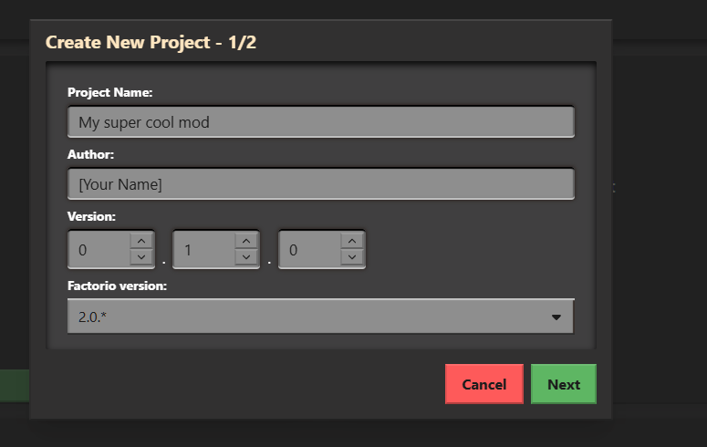

# Creating a Project

Create your first project

## The Dashboard

After installing and starting FMCS, you can open `localhost:3000` in your browser
The Dashboard should show up, there you can see and manage all your projects.
There will be a project called `FMCS TEMPLATE`, we will be using it for this guide.

## Adding Projects

We will now create our first Project.

1. Click the **Create New Project** button.  
2. A popup will appear. Fill in the form as shown in the image below, then click **Next**.  

     

3. You can either leave **Description** empty or set it to:  
   **My first mod in FMCS**

4. Click Finish!

Congratulations! You created yor first Project! 🥳
