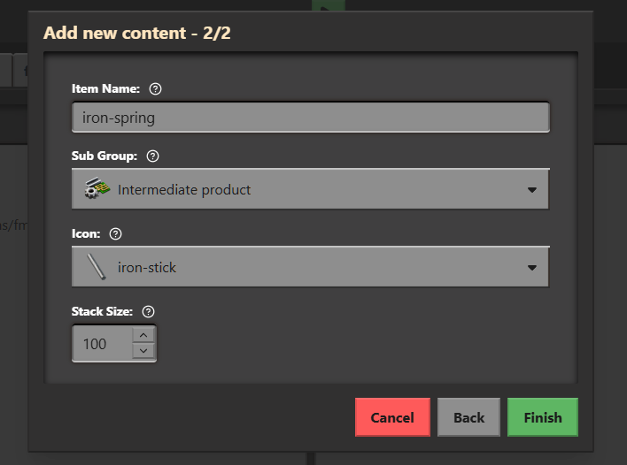

# Content: Items

Adding Items

## Adding Items

To add an item simply click on the + icon in the content panel.
Then select `Item` from the list and click next.  
Now fill the form with the following:

    

We will replace the icon later on!
Now click on `Finish`, the `iron-spring` item will now open,  
you can edit props and save with
<kbd>Ctrl</kbd> + <kbd>S</kbd>

### Whats next?

In the next guide we will add a matching icon to our `iron-spring`
