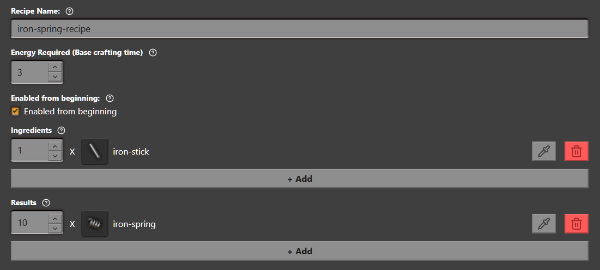

# Content: Recipes

Adding Recipes

## Adding Recipes

As always click on the + icon in the content panel.
Then select `Recipe` from the list and click next.  
Now fill the form with a name like `iron-spring-recipe`,
and set Energy Required to 3

Now click on `Finish`

### Adding Ingredients and Results to Recipes

Select the `iron-spring-recipe` recipe from the Content Panel
and click on the big `+ Add` button in the Ingredients category.  
A new entry will now be added.  
Change the item by clicking the pipette button or by clicking on   the icon.  
Select the `iron-stick` (Its called iron rod ingame) from `intermediate-products`.
Click on `Choose iron-stick`.  

Repeat the same for the Results category,
but choose our `iron-spring` item from the `Mod Added` tab

Don't forget to save! ( <kbd>Ctrl</kbd> + <kbd>S</kbd> )

Heres the finished recipe:

### Whats next?

In the next guide we will cover how to build and test your mod
